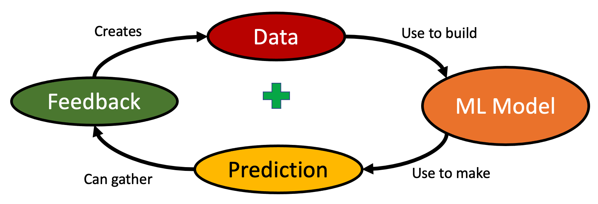

# The AI Flywheel
 
A positive feedback cycle where good predictions cause more use of a service which provide more feedback data to create better predictive models.

## Key Steps

The AI Flywheel has four key steps:

1. More data creates more precise machine learning models
2. Machine learning models make predictions about the future
3. Every time we make a prediction, we can get feedback on how good that prediction was
4. Feedback is a new data source for our predictive models

## Key Insights

There are two key insights:

1. Building your first machine learning model is hard.
2. Getting feedback from your predictions is also hard.

Once you get enough feedback, your predictions get better and more users will use your tools.

## Feedback is the Key

If your models don't produce recommendations that get feedback your model will not evolve over time.

Creating a predictive model is never a one-and-done task.  It is a process of continuous improvement.

In the real-world things are changing all the time.  The key to building intelligent systems is to continually learn from new data and new variations in existing data.

## Impacts on Business Strategy

The AI Flywheel is a central tool that allows large companies with large amounts of data to use this data to get even more data.  This makes it difficult for new-entrants to challenge incumbents players.
