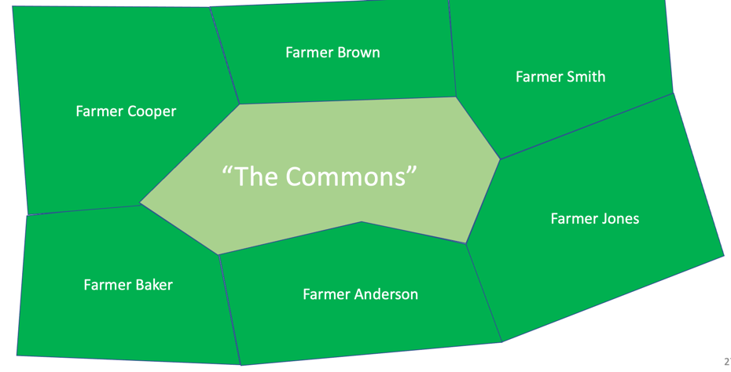

# Tragedy of the Commons

## Solutions Tragedy of the Commons

1. Educating about sustainability and how to monitor
2. Enforcing laws limiting use of a resource
Privatizing the resource so that each participant must pay for the the direct impact of his/her actions

## References

* 