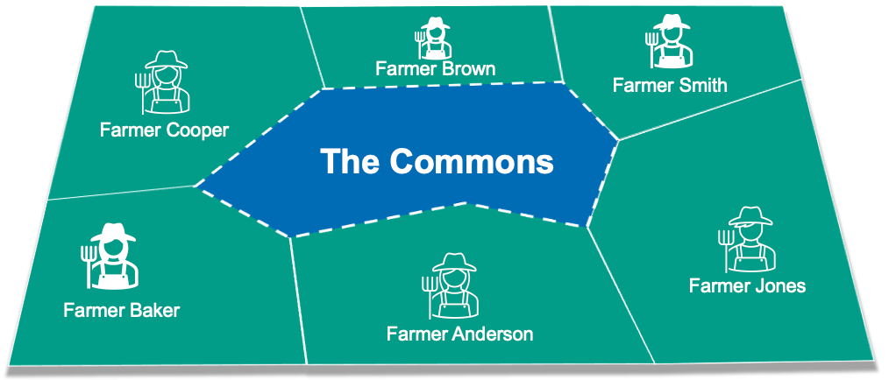
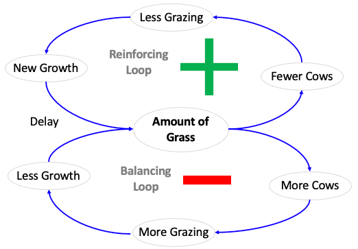
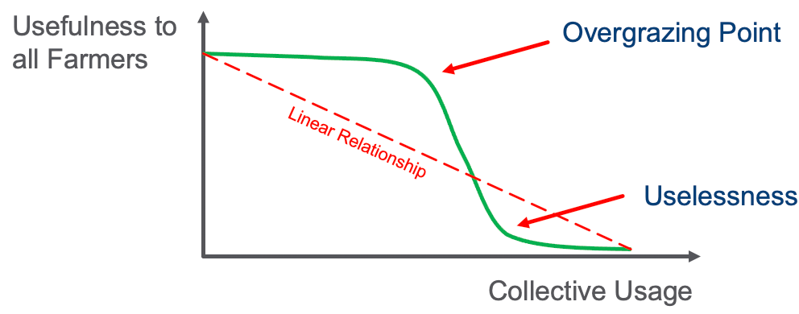

# Tragedy of the Commons

Summary: When short-term self-interest leads to a tragedy for all.

This example originally came from the field of Economics.  The tragedy of the commons is one of the most common archetypes in systems thinking.  It is described as follows:

A small village has many farmers near it.  Each farmer has their own private land.  However, there is a large shared pasture in the middle of the village.

Individual farmers, who have open access to a shared pasture, act independently according in their own self-interest and, contrary to the common good of all farmers, cause overgrazing of the shared pasture.  This overgrazing makes the pasture have no value to the entire community.

This archetype can be represented with two simple loops, one for adding cows and one for removing cows.

## Causal Loop Diagram

Here is a sample causal loop diagram.  There are two loops.  One adds more cows, but this triggers overgrazing and after a delay, the grass all dies.  The other loop removes cows and this allows the grass to recover and the pasture is more beneficial to everyone.

## Nonlinear Behavior

We can see that if the shared pasture has light usage - for example only one farmer per day, then the pasture can be maintained.  However, if the farmers get greedy, they will overgraze the land.  At some point the grass will not have time to recover and new grazing kills the graph.  This can happen suddenly, and might be an example of non-linear behavior of a system.

## References

* [Wikipedia Page on Tragedy of the Commons](https://en.wikipedia.org/wiki/Tragedy_of_the_commons)