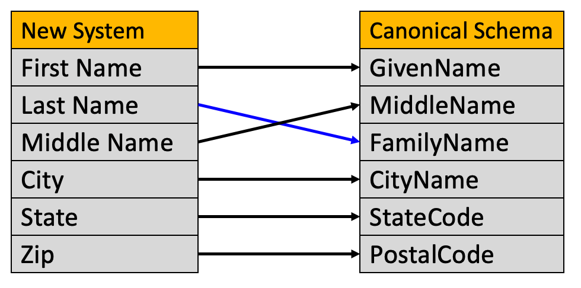

# Concept Standards

When we build systems, we need to think carefully about how they exchange data with other systems.  There are two ways to do this:

1. *Point-to-Point* - Where each system communicates with every other system.  The number of edges required is on the order of N-squared.
2. *Hub-and-Spoke* - Where each system published content to a hub and any subscriber can get just the data they need.  The number of edges scales as N.

## Problems with Scale

Point-to-Point systems work well for small organizations that only have a few systems that need to share information.  The problem is that for each new system added, there are many systems that need to connect to it.  The number of edges rises as the square of the number of systems that need to communicate.  This is often referred to as the linear vs. quadradic scaling law.

Whenever we see a quadratic cost curve we want to understand how to avoid quickly escalating costs.  We want to be on the linear cost curve as our organization grows.  But this cost curve is not yet a good model of the cost of creating modern hub-and-spoke systems.  In order to do this, we need to understand the work involved in creating a "hub".  In general, the hub is the place where we must carefully understand the meaning of data in order to map it to a standard vocabulary.

## Costs of Establishing Shared Meaning

The problem with implementing hub-and-spoke systems is that it only works if the writer and the reader have a shared meaning.  There are always costs to create systems that promote shared meaning.   In general, we call these systems [Metadata Registries](../glossary#metadata-registry). This is the place where people come together to set standards on how data is communicated on a data-element by data-element level.

## Data Element Matching

In order to keep our costs low, we need to build systems that do metadata matching. For example, we might want to match all the data elements from a new system with the data elements in an data standard we agree on.  This internally agreed-upon representation of data is called the [Canonical Schema](../glossary#canonical-schema)

## Costs of Schema Matching and Mapping