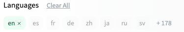

# Search and Reuse Archetype

*You can't reuse what you can't find.*


Note that this archetype is written from the reusable code perspective, but it also applies to other reusable assets such as images, digital content, datasets and models use for machine learning.

## Positive Reinforcement Cycle

1. Any reusable code or dataset is described clearly and documented when and how to use it.
1. As code is checked into the revision control system, it is indexed by a central search engine.
1. A user interface is created to quickly allow users to find only the software that is relevant to their task.  This implies faceted search based on domain, language, interfaces etc.
1. Users can quickly see of pre-built code is suitable for their tasks.  They can see use-cases of other teams that have already used the code and view comments and bug reports as well as the speed that the bugs were fixed.
1. Teams can then use the code, contribute to the code and 

## Negative Feedback

The negative feedback cycle can be expressed in four parts:

1. *You can't reuse what you can't find.*
2. *What you don't reuse you will rewrite.*
3. *Once you rewrite you will defend.*
4. *Defensive organizations become heavily siloed.*

## Examples of Great Search

### HuggingFace Model Search

HuggingFace is the world leader in the storage and search of machine learning models and datasets.  They have more reuseable public machine learning models than all the cloud vendors combined.  But the number of models (in the tens of thousands as of June 2022) is overwhelming.  To solve this problem, HuggingFace implemented "faceted" search.  Each additional facet is an orthogonal dimension of data.  By selecting two or more you can effectively do an Boolean "AND" operation:

```sql
WHERE CONDITION1 = VALUE1 and CONDITION2 = VALUE2
```

### HuggingFace Exercise

In this demo, we show the power of using faceted search to narrow down the total number of machine learning models in a collection.

1. Go to [https://huggingface.co/models](https://huggingface.co/models).
2. Look at the count of models
3. Go to the left side and select only English Language models.  Note the new count!  It is typically 1/100th of the total model count.
4. Now add only the models training on Wikipedia - the model count is 1/10th of the prior value.

