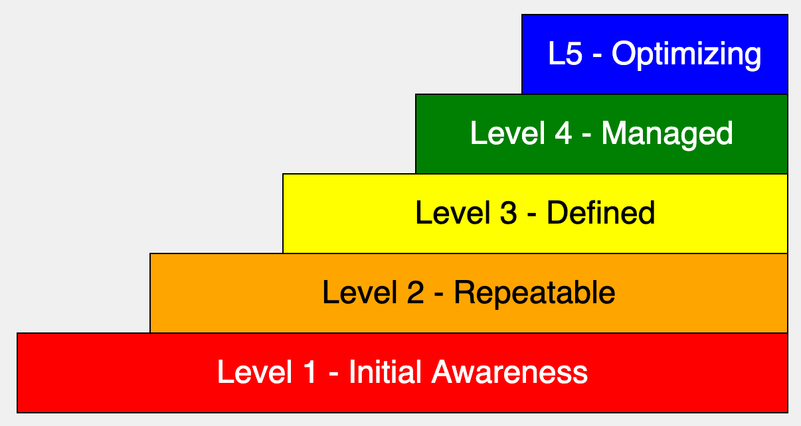

# Capability Maturity Model



[Run the MicroSim]()

## Prompt

```linenums="0
Create a single file p5.js sketch on a 600x400 canvas.
Make the default text size be 16.
Create a five layer stair step diagram of a capability-maturity model.
The first layer is at the bottom and covers the width of the canvas.
The top layer in smaller at the top right.
As the user hovers the mouse over each layer, a detailed text description of that layer will appear below the steps.
The rectangle colors will be L1: red, L2: orange, L3: yellow, L4: green, L5: blue.
The text color in the L2: orange and L3: yellow will be black.
The text in the red, green and blue will be white.
Use the following text for the level definitions and descriptions:

Level 1 - Initial
Initial is characteristic of processes at this level that they are (typically) undocumented and in a state of dynamic change, tending to be driven in an ad hoc, uncontrolled and reactive manner by users or events. This provides a chaotic or unstable environment for the processes. (Example - a surgeon performing a new operation a small number of times - the levels of negative outcome are not known).
Level 2 - Repeatable
Repeatable is characteristic of this level of maturity that some processes are repeatable, possibly with consistent results. Process discipline is unlikely to be rigorous, but where it exists it may help to ensure that existing processes are maintained during times of stress.
Level 3 - Defined
Defined is characteristic of processes at this level that there are sets of defined and documented standard processes established and subject to some degree of improvement over time. These standard processes are in place. The processes may not have been systematically or repeatedly used - sufficient for the users to become competent or the process to be validated in a range of situations. This could be considered a developmental stage - with use in a wider range of conditions and user competence development the process can develop to next level of maturity.
Level 4 - Managed (Capable)
Managed is characteristic of processes at this level that, using process metrics, effective achievement of the process objectives can be evidenced across a range of operational conditions. The suitability of the process in multiple environments has been tested and the process refined and adapted. Process users have experienced the process in multiple and varied conditions, and are able to demonstrate competence. The process maturity enables adaptions to particular projects without measurable losses of quality or deviations from specifications. Process Capability is established from this level. (Example - surgeon performing an operation hundreds of times with levels of negative outcome approaching zero).
Level 5 - Optimizing (Efficient)
It is a characteristic of processes at this level that the focus is on continually improving process performance through both incremental and innovative technological changes/improvements. At maturity level 5, processes are concerned with addressing statistical common causes of process variation and changing the process (for example, to shift the mean of the process performance) to improve process performance. This would be done at the same time as maintaining the likelihood of achieving the established quantitative process-improvement objectives.

```