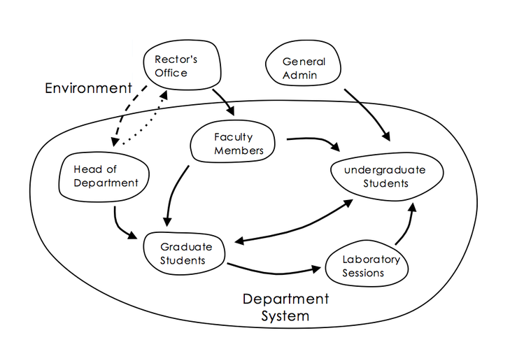
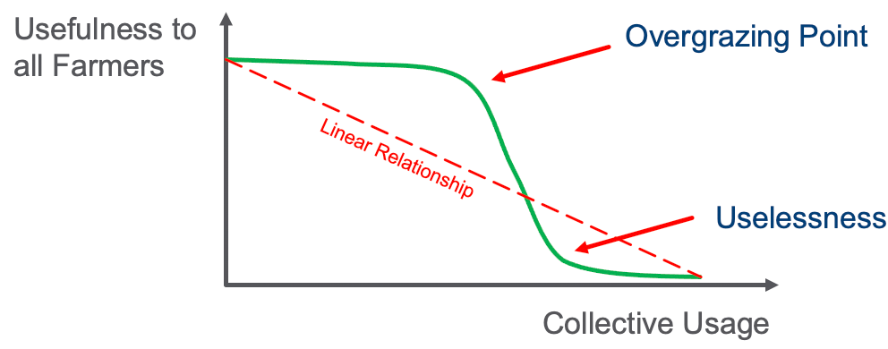

# Glossary of Terms

#### AI Flywheel

A system where machine learning models make predictions from data, get feedback from prediction and use that feedback as additional data to make better predictions.

The AI Flywheel is a central tool that allows large companies with large amounts of data to use this data to get even more data.  This makes it difficult for new-entrants.

#### Archetype
An ideal example of something.  In the field of Graph Systems Thinking we use the term **archetype** to describe a small and simple example that teaches one of the key concepts in Graph Systems Thinking.

A small set of system structures that produce common behavioral patterns across many different fields.

Archetypes unify disciplines that have often been taught as separate things – psychology, economics, biology, urban planning, technology, government systems, etc. – because they can be universally found in all systems.

Archetypes are to systems what Patterns are to software.

* See Also: [Tragedy of The Commons](#tragedy-of-the-commens)
* Seel Also: [The AI Flywheel](#ai-flywheel)

#### Balancing Loop
A type of cause and effect interactions that counter a change with a push in the opposite direction.

* Also known as: Negative feedback

#### Canonical Schema

A standardized official approved way to represent data on-the-wire as it moves between computer systems.

The process of converting non-standardized representations of data is to perform [Schema Matching](#schema-matching) and [Schema Mapping](#schema-mapping).

#### Causal Loop Diagrams
Diagrams that show the dynamic relationship of sub-components of Systems where changes in the state of any component have causal impacts on other components of the system.

#### Denormalized Data Model
A data model that has been flattened to use multiple columns to represent different dimensions of the real world.

* Denormalized data is easier to load into relational databases
* Denormalized data may be more difficult to query

#### Digital Twin
A representation of a real-world item in a virtual world.  EKGs are a way to model real-world components that interact with each other.

#### Dynamics
The change of component stocks and system interconnections over time.

#### Dynamic Equilibrium
The stage in the evolution of a system where the flows between system components reaches a balancing point.

#### Edge of Chaos
A transition space between order and disorder that is hypothesized to exist within a wide variety of systems. This transition zone is a region of bounded instability that engenders a constant dynamic interplay between order and disorder.

Within the context of EKGs, it is the region that should be modeled to give the highest return on investment.

* [Wikipedia Page on the Edge of chaos](https://en.wikipedia.org/wiki/Edge_of_chaos)

#### Feedback
A chain of events that begin when outputs of a component are routed back as inputs as part of a chain of cause-and-effect that forms a circuit or loop.

#### Feedback Delay
The time it takes for a stimulus to trigger events that return to impact the original source of the stimulus.

#### Flow
The migration of ideas, information or resources from one system component to other system components over time.

#### Graph Database
A database of items that is decomposed into vertices and edges, each of which have attributes.

There are many types of graph databases that model the state of the world in different ways.  What many of them share in common is their ability to traverse relationships between items without using query time JOIN comparisons of primary and foreign keys.  JOIN operations became one of the principal reasons that graph databases provide 1,000x performance over relational databases.

#### Graph Systems Thinking
A multidisciplinary field of study that uses systems thinking to understand the business value of connected data.

* Also known as: GST

#### Hierarchy
A systems diagram where material or information flows up and down a tree-like structure.

#### Influence Diagram
A type of causal graph that shows how individuals or groups impact each other's thinking.

#### Knowledge Representation

#### ISO Definition
A term definition that conforms to ISO/IEC 11179 metadata registry guidelines.

* **Precise:** - The definition should have clear meaning and semantics using words with narrow definitions.
* **Concise:** - The definition should be as short as possible in length without compromising precision.  Good definitions are typically 1 or 2 sentences.
* **Distinct** - The definition does not have the same definition as other concepts in a vocabulary.
* **Noncircular** - The definition does not use the original term in defining the definition.
* **Unencumbered with Rules** - There are no context-specific business rules that would limit the use of the term to a narrow context.  Rules can be stated after a definition but should not be part of the ISO definition.

The origin of these guidelines for ISO definition comes from work in the ISO/IEC 11179 Metadata Registry standards committee.

#### Leverage Points
Places in a system where a small change can lead to a large change in system behavior.

#### Limiting Factor
A factor in a system that limits it ability to perform.

* Relational database JOIN performance has been a key limiting factor in creating precise real-world models within databases.

#### Linear Relationship

#### Nonlinear
In the field of systems dynamics, nonlinear refers to the fact that a small change in one component may result is a large changes in related component.

The figure above is an example of the non-linear utility in the Tragedy of the Commons archetype.

Our brains need special training to understand the ways that nonlinear systems interact and to understand the long-term impact of nonlinear dynamics.

For example, in ecology a small change in the level of carbon dioxide in the atmosphere may cause a large change in global temperature.

In commerce, a small change in product quality may lead to poor reviews, lower recommendations and a dramatic drop in sales.

* [Nonlinear system in Wikipedia](https://en.wikipedia.org/wiki/Nonlinear_system)

#### Normalized Data Models
Data models that faithfully model the complex relationships of the real world.

* When models capture the real-world accurately, they can be shared among many business units.
* Highly normalized data models don't scale well on older RDBMS technologies.

#### Resilience
The ability of systems to retain stable functionality under changing conditions.

#### Reinforcing Loop
An amplifying or enhancing feedback loop, also known as a “positive feedback loop” because it reinforces the direction of change.

These are vicious cycles and virtuous circles.

#### Scale Out
The ability of a graph database to grow in capability by adding new computational resources to a database cluster.

#### Self-organization

#### Shifting Dominance
The change over time of the relative strengths of competing feedback loops.

#### Stock
An accumulation of material or information that has built up in a system or a sub-component over time.

A stock may include the memory of the history of changing flows within the system.

#### Suboptimization
The behavior resulting from a subsystem’s goals dominating at the expense of the total system’s goals.

#### Sustainability
Systems that perform well over time despite changes in their environment.  Sustainable systems have resilience despite unexpected changes in either external or internal changes in both structure and flows of information.

#### Systems Dynamics
How systems change over time.

[Systems Dynamics](https://www.youtube.com/watch?v=nxlHUW3jZeY&t=7s)

#### System
A cohesive group of interrelated yet interdependent parts which interact over time.

Systems are both natural or human-made.

#### Systems Thinking
A problem solving method that decomposes complex entities into a set of parts that interact over time.

#### System Theory
The interdisciplinary study of systems.

#### Tragedy of the Commons

#### Unintended Consequences
Outcomes of a purposeful action that are not intended or foreseen.

*[W](https://en.wikipedia.org/wiki/Unintended_consequences)