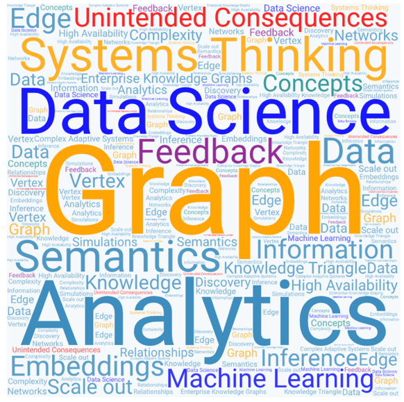

# Systems Thinking for Technologists

Welcome to our website.  The goal of this website
is to promote systems thinking for IT professionals.
Whenever there are shared IT resources questions come
up as to how we can fairly allocate these resources.
Systems Thinking provides a great framework to do this.

We have also been asked to apply Systems Thinking
to break down organizational silos and share
data across business areas.  You will find
many resources on these topics as well
as how to accelerate the adoption of
Enterprise Knowledge Graphs (EKGs) in your organization.

Please let me know if you have any questions or
feedback on this website.

Dan McCreary [Dan on LinkedIn: https://www.linkedin.com/in/danmccreary/](https://www.linkedin.com/in/danmccreary/)

