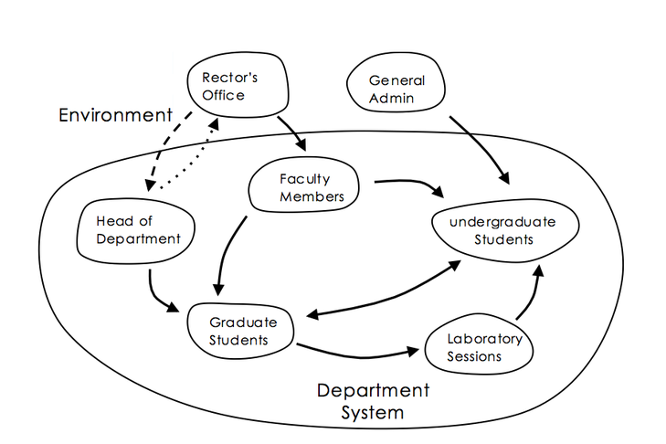

# Chapter 4: EKG Systems Cases Studies

Chapter Overview

* The Predictive Feedback Cycle
* Employee Career Paths
* Standardize Cycles

## The Predictive Feedback Cycle

The AI flywheel.  Data -> Prediction -> Better Use -> More Data

## Company Training: Out to go up

New Employee Hired -> Great Internal Training -> New Skills -> External Offers Come In -> Employees Leave

New Employee -> No Training or Training on Obsolete Tech (COBOL) -> Employee Stays and Teaches COBOL

## Data Standardization Cycles

Ten Groups/Ten Standards -> Central Warehouse Fail -> Data Marts Too Expensive -> Few Insights - Lower Marketplace

Ten Groups -> Great Canonical Model -> Shared EKG -> Deep Insights -> More Marketshare

## CIO Influence Diagram

## Low-Resolution Data Models
* Data modeling team gets burned on slow JOIN performance
* Try to denomalize data models to minimize JOINS

