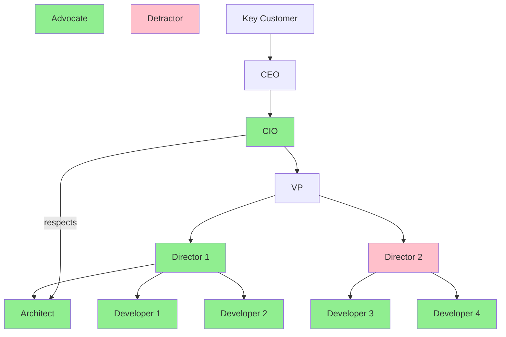

# Influence Diagram

```mermaid
graph TB
    advocate[Advocate]
    detractor[Detractor]
    ceo[CEO] --> cio[CIO]
    cio --> vp[VP]
    vp --> dir1[Director 1]
    vp --> dir2[Director 2]
    dir1 --> arc[Architect]
    cio -->|respects| arc
    dir1 --> dev1[Developer 1]
    dir1 --> dev2[Developer 2]
    dir2 --> dev3[Developer 3]
    dir2 --> dev4[Developer 4]
    kc[Key Customer] --> ceo


    style advocate fill:lightgreen
    style detractor fill:pink
    style cio fill:lightgreen
    style dir1 fill:lightgreen
    style arc fill:lightgreen
    style dev1 fill:lightgreen
    style dev2 fill:lightgreen
    style dev3 fill:lightgreen
    style dev4 fill:lightgreen
    style dir2 fill:pink
```