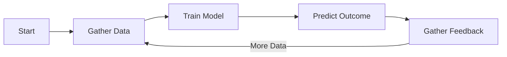
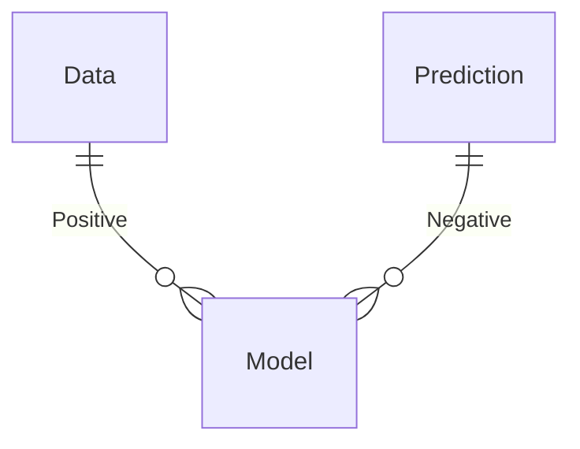
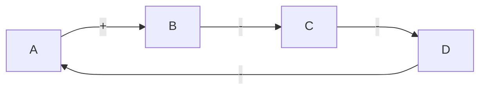
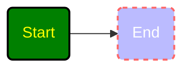

# Render Tests

```mermaid
graph LR
    Start --> gd[Gather Data]
    gd --> tm[Train Model]
    tm --> po[Predict Outcome]
    po --> gf[Gather Feedback]
    gf --> |More Data| gd
```

```mermaid
erDiagram
    Data ||--o{ Model : Positive
    Prediction ||--o{ Model : Negative
```

```mermaid
graph LR
    A --->|+| B
    B --->|-| C
    C --->|-| D
    D --->|-| A
```

```mermaid
graph LR
    Start(Start)-->End(End)
    style Start fill:green, stroke:black, stroke-width:2px, color:yellow
    style End fill:#bbf, stroke:#f66, stroke-width:2px, color:#fff, stroke-dasharray: 5 5
    
```