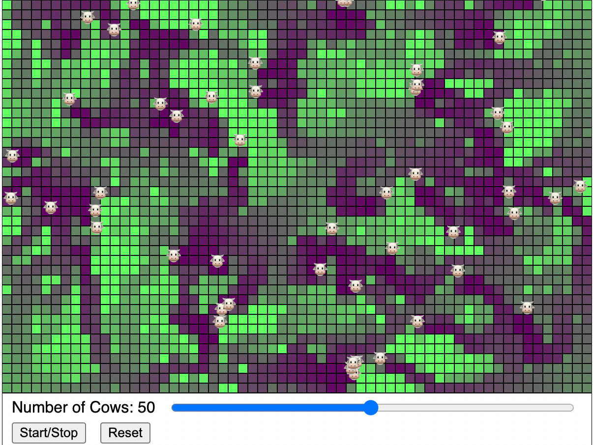

# Tragedy of The Commons

{ width="500" }

[Link to Tragedy of the Commons MicroSim](toc.html){ .md-button .md-button--primary }
[Edit](https://editor.p5js.org/dmccreary/sketches/2NYEIUklI)

## About this MicroSim

This MicroSim teaches us the story of the Tragedy of
the Commons.  As you add more cows to the pasture, the
grass gets over-grazed.

Creating a simulation of the "Tragedy of the Commons" is a great way to help students understand the consequences of individual actions on shared resources. The "Tragedy of the Commons" refers to a situation in a shared-resource system where individual users, acting independently according to their own self-interest, behave contrary to the common good of all users by depleting or spoiling the shared resource.

## Sample Prompt

```linenums="0"
Create a simulation of the Tragedy of the Commons.
```

## Refinements

1. Make the cows go towards the most grass
2. Make the grass permanently die if it reaches a level of 0
3. Make the cows die if they don't eat enough grass
4. Use the cow emoji:

```py
show() {
    text("🐮", this.pos.x, this.pos.y);
}
```
## Other Extensions

Here's a step-by-step guide on how you could set up such a simulation:

1.  **Define the Shared Resource**: Start with a shared resource that is easily understandable, such as a fishing lake, a grazing field, or a forest for timber. The resource should have a limit to how much it can be used sustainably.

2.  **Create User Profiles**: Develop profiles for different users of the resource. These users should have the ability to extract or use the resource at varying rates. For instance, in a fishing lake simulation, each user could decide how many fish to catch per turn.

3.  **Set Resource Regeneration Rules**: Establish rules for how the resource regenerates over time. For a fish population, you could have a growth rate that depends on the remaining population size.

4.  **Develop a User Interface**: Create an interface where students can make decisions for their user profile. Include sliders or input fields where they can decide how much of the resource to use each turn.

5.  **Implement Feedback Mechanisms**: The simulation should provide feedback on the state of the common resource after each round of usage, showing how the resource level changes based on the collective actions of all users.

6.  **Introduce Scenarios or Challenges**: You could introduce external factors that affect the resource, like environmental changes, to add complexity.

7.  **Incorporate Visualizations**: Graphs or other visual aids can help students see the long-term trends of the resource level and the impacts of their decisions.

8.  **Facilitate Discussion and Debriefing**: After the simulation, hold a discussion. Ask students to reflect on how their actions affected the resource and what strategies could have led to more sustainable outcomes.

9.  **Draw Connections to Real-world Issues**: Relate the simulation to real-world examples of the Tragedy of the Commons, like overfishing, deforestation, and pollution. This helps students understand the practical implications of the concept.

10.  **Highlight the Role of Regulations and Agreements**: Discuss how regulations, agreements, or cooperative strategies could prevent the tragedy of the commons. This could lead to a deeper understanding of environmental policies and community management strategies.

Through this interactive experience, students can grasp the challenges of managing shared resources and the importance of sustainable practices and cooperation.